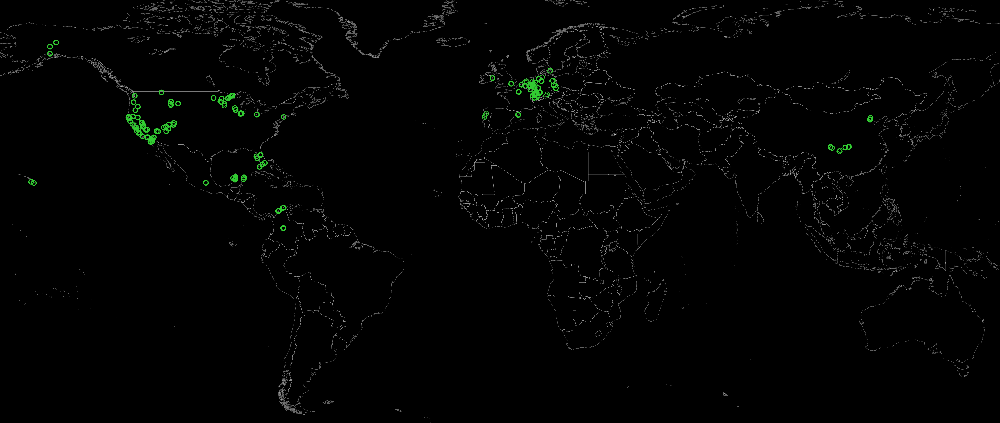

# gmaps_pin_plotter

This is a script to plot google maps pins using matplotlib.

World map data is from [naturalearthdata](https://www.naturalearthdata.com/downloads/10m-cultural-vectors/10m-admin-0-countries/).

Extract the pin data from [google takeout](https://takeout.google.com) under:

1. "Maps (your places)" - contains pins of only the "star" type.
2. "Saved" - contains other categories of pins (not currently plotted).